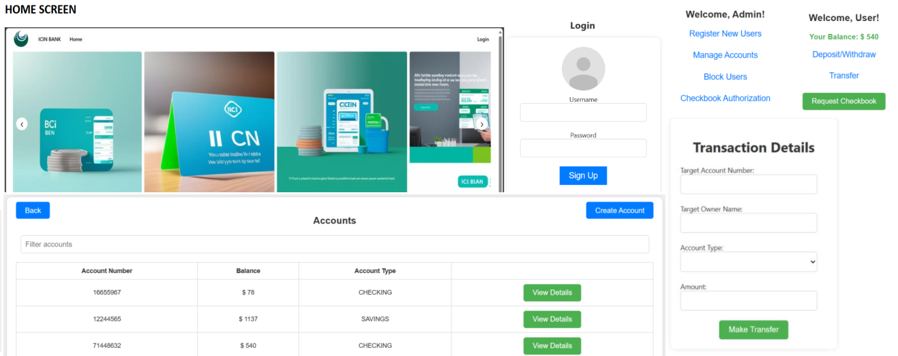

# ICIN Bank

### This project was done as part of the Simplilearn FSD Master Course.

ICIN is one of the top banking firms that accepts deposits from the public for the purpose of lending loans to the public. 
Recently, the business analysts noticed a drop in the number of customers of the bank. 
They found out that online banking systems of banks like AXIS and American Express are gaining more profits by eliminating middlemen from the equation. 
As a result, the team decided to hire a Full Stack developer who can develop an online banking web application with a rich and user-friendly interface.
You are hired as one of the Full Stack Java developers and have been asked to develop the web application. 
The management team has provided you the requirements and their business model so that you can easily arrange different components of the application.

### Features 
* Registration
* Login
* Account transactions
* Transfers
* Savings details
* Profile settings
* Requesting cheque books

Admin Portal:
It deals with all the back-end data generation and product information. The admin user should be able to:

* Authorize the roles and guidelines for the user
* Grant access to the user regarding money transfer, deposits, and withdrawal
* Block the user account in case of any threat
* Authorize the cheque book requests

User Portal:
It deals with the user activities. The user should be able to:
* Register or log in to the application to maintain a record of activities
* Deposit and withdraw money from the account
* View transactions and balance in the primary and savings account
* Transfer funds between different accounts and add recipients
* Request cheque books for different accounts

## Technologies Used
Spring Boot * Spring Security * Lombok * MySQL * JWL * Docker * Angular
